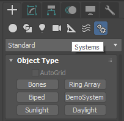

## SimpleSystem
A simplified re-implementation of the existing [Ring Array System](https://knowledge.autodesk.com/support/3ds-max/learn-explore/caas/CloudHelp/cloudhelp/2016/ENU/3DSMax/files/GUID-9C8591CE-7280-480F-AEBD-5E62E4F79CC9-htm.html), whose source code can be found in ```maxsdk\samples\objects\RingArray.cpp``` file within 3ds Max SDK.

A detailed, yet somehow outdated overview and explanation of how the Ring Array System plugin is implemented, can be found within 3ds Max SDK documentation at [3ds Max Developer Help/Writing Plug-ins/Writing System Plug-ins](http://help.autodesk.com/view/3DSMAX/2017/ENU/?guid=__files_GUID_13C3CE2C_4243_4ECA_BFF5_9E4A9001FE9B_htm).
This overview is applicable to the current SimpleSystem, however the Parameter Block related part was updated to use the [ParamBlock2](http://help.autodesk.com/view/3DSMAX/2017/ENU/?guid=__files_GUID_CC09846C_8115_46CF_8DC1_9C4F1A06991A_htm) with automatic UI "link".

For simplicity reasons (and to make the code easy to read), parts like [Function Publishing](http://help.autodesk.com/view/3DSMAX/2017/ENU/?guid=__files_GUID_D11DA39D_8190_44A6_B5B1_8F5E94FDA46F_htm), [The Undo and Redo System](http://help.autodesk.com/view/3DSMAX/2017/ENU/?guid=__files_GUID_E4955E4E_A358_4C66_8504_5A3CD3B20D89_htm), [Loading and Saving](http://help.autodesk.com/view/3DSMAX/2017/ENU/?guid=__files_GUID_D47D210B_A10A_47B2_BFDE_5477ACE40E89_htm) and [Clone support](http://help.autodesk.com/view/3DSMAX/2017/ENU/?guid=__files_GUID_12F9AC01_4AEA_4AC6_83CA_C8A89885BE51_htm) were deliberately left unimplemented, to focus this sample on aspects specific to System plugin types, that can be found in the Systems category:

 

Here this plugin can be found under name ```DemoSystem```.
